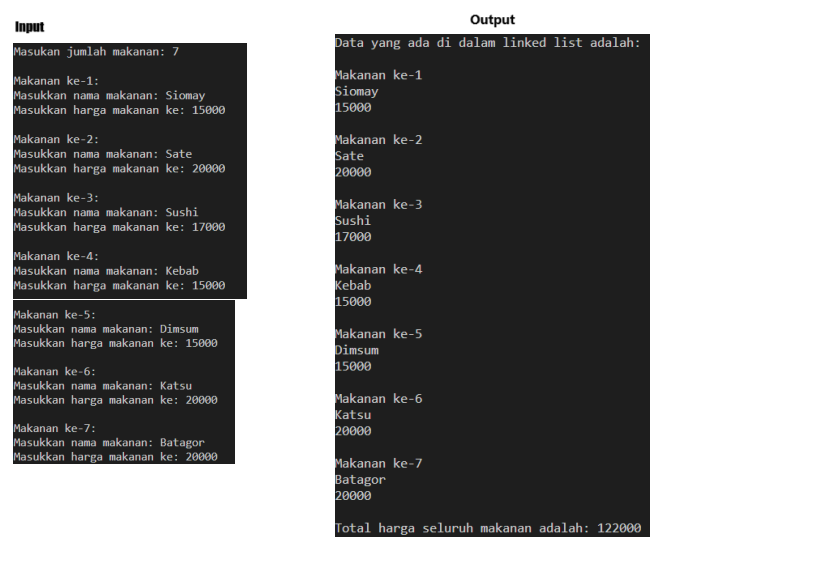
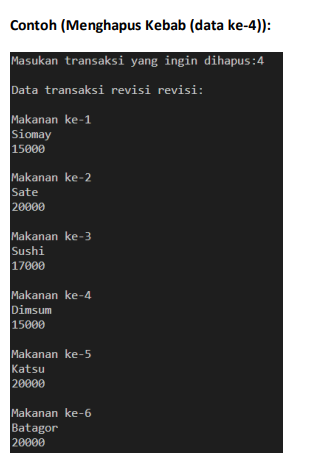

# Tugas Praktikum Modul 6

Nama : [Change Me]

NPM : [Change Me]

# Soal Teori

## 1. Apa itu linked list? Mengapa linked list tergolong sebagai dynamic data structure? (10 poin)

Lorem ipsum dolor sit amet, consectetur adipiscing elit, sed do eiusmod tempor incididunt ut labore et dolore magna aliqua. Non curabitur gravida arcu ac tortor. Dapibus ultrices in iaculis nunc sed augue. Orci ac auctor augue mauris augue neque. Dictumst vestibulum rhoncus est pellentesque elit. In ornare quam viverra orci. Purus semper eget duis at tellus at urna condimentum. Vitae justo eget magna fermentum iaculis eu. Venenatis a condimentum vitae sapien pellentesque. Faucibus scelerisque eleifend donec pretium vulputate. Nisl pretium fusce id velit ut tortor pretium viverra suspendisse. Vitae sapien pellentesque habitant morbi tristique senectus.

### Referensi :

## 2. Sebutkan kelebihan dan kekurangan linked list dibanding dengan array dan data structure statis lainnya (20 poin)

Lorem ipsum dolor sit amet, consectetur adipiscing elit, sed do eiusmod tempor incididunt ut labore et dolore magna aliqua. Non curabitur gravida arcu ac tortor. Dapibus ultrices in iaculis nunc sed augue. Orci ac auctor augue mauris augue neque. Dictumst vestibulum rhoncus est pellentesque elit. In ornare quam viverra orci. Purus semper eget duis at tellus at urna condimentum. Vitae justo eget magna fermentum iaculis eu. Venenatis a condimentum vitae sapien pellentesque. Faucibus scelerisque eleifend donec pretium vulputate. Nisl pretium fusce id velit ut tortor pretium viverra suspendisse. Vitae sapien pellentesque habitant morbi tristique senectus.

### Referensi :

## 3. Jelaskan apa yang dimaksud dari node, head, dan tail? Jelaskan masing-masing kegunaannya dalam sebuah linked list. (20 poin)

Lorem ipsum dolor sit amet, consectetur adipiscing elit, sed do eiusmod tempor incididunt ut labore et dolore magna aliqua. Non curabitur gravida arcu ac tortor. Dapibus ultrices in iaculis nunc sed augue. Orci ac auctor augue mauris augue neque. Dictumst vestibulum rhoncus est pellentesque elit. In ornare quam viverra orci. Purus semper eget duis at tellus at urna condimentum. Vitae justo eget magna fermentum iaculis eu. Venenatis a condimentum vitae sapien pellentesque. Faucibus scelerisque eleifend donec pretium vulputate. Nisl pretium fusce id velit ut tortor pretium viverra suspendisse. Vitae sapien pellentesque habitant morbi tristique senectus.
### Referensi :
## 4. Apa saja operasi yang dapat dilakukan pada suatu linked list? Ilustrasikan jenis-jenis operasi tersebut. (30 poin)
### Contoh: Bagaimana proses insertion suatu node pada Linked List
Lorem ipsum dolor sit amet, consectetur adipiscing elit, sed do eiusmod tempor incididunt ut labore et dolore magna aliqua. Non curabitur gravida arcu ac tortor. Dapibus ultrices in iaculis nunc sed augue. Orci ac auctor augue mauris augue neque. Dictumst vestibulum rhoncus est pellentesque elit. In ornare quam viverra orci. Purus semper eget duis at tellus at urna condimentum. Vitae justo eget magna fermentum iaculis eu. Venenatis a condimentum vitae sapien pellentesque. Faucibus scelerisque eleifend donec pretium vulputate. Nisl pretium fusce id velit ut tortor pretium viverra suspendisse. Vitae sapien pellentesque habitant morbi tristique senectu.

## 5. Jelaskan jenis-jenis linked list yang ada serta perbedaan yang dimiliki linked list tersebut (20 poin)

Lorem ipsum dolor sit amet, consectetur adipiscing elit, sed do eiusmod tempor incididunt ut labore et dolore magna aliqua. Non curabitur gravida arcu ac tortor. Dapibus ultrices in iaculis nunc sed augue. Orci ac auctor augue mauris augue neque. Dictumst vestibulum rhoncus est pellentesque elit. In ornare quam viverra orci. Purus semper eget duis at tellus at urna condimentum. Vitae justo eget magna fermentum iaculis eu. Venenatis a condimentum vitae sapien pellentesque. Faucibus scelerisque eleifend donec pretium vulputate. Nisl pretium fusce id velit ut tortor pretium viverra suspendisse. Vitae sapien pellentesque habitant morbi tristique senectus.

# Soal Pemrograman

## 1. Basic Linked List Traversal (25 Poin)

Buatlah linked list secara static, yang terdiri dari 5 buah node. Setiap node memiliki sebuah value dengan data type integer yaitu angka 1 hingga 5, serta pointer menuju node selanjutnya. Lakukan traversal yang memprint setiap value dari node.

Output print yang diharapkan:
1->2->3->4->5
*Gunakan for atau while loop untuk melakukan traversal dan printing linked list*
### Video: Jelaskan kode yang telah anda buat. Apakah anda menggunakan null di dalam kode anda? jika iya, jelaskan fungsi null tersebut dalam proses traversal. Jika tidak, jelaskan metode traversal yang anda gunakan.

## 2. Sistem Cashier Makanan (75 poin)

Suatu hari anda diberikan tugas untuk membuat sistem kasir sederhana pada acara Bogor Food Festival. Sistem kasir ini akan mencatat segala transaksi yang terjadi di Food Festival dan programnya menggunakan data structure berupa linked list. 
Format inputan per transaksi berisikan data sebagai berikut: 
1. Nama Makanan (Untuk mempermudah, asumsikan semua makanan hanya mengandung 1 kata) 
2. Harga Makanan Setelah melakukan input semua transaksi, maka sistem akan melakukan rekap dengan menampilkan seluruh data transaksi beserta total pemasukan yang di dapatkan.

Contoh :
Format Input Output:

Setelahnya tambahkan fitur untuk menghapus makanan yang dipilih

Dalam pembuatan program anda dapat membuat menu sederhana agar user dapat memilih untuk menambah, menampilkan, atau menghapus makanan.
### Video: Jelaskan alur program yang dibuat. Bagaimana proses traversal digunakan untuk menambah dan menghapus menu makanan?

